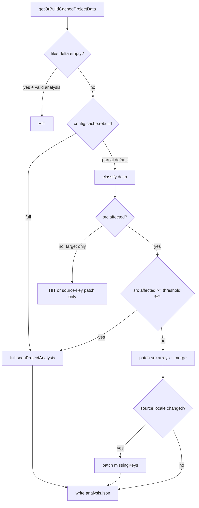

# Project cache phase — disk index + analysis rebuild (**active**)

**Status:** **In progress** — segment-aware **`files.json`** + single **`analysis.json`** slot are **shipped** in core + CLI. **Incremental analysis rebuild** (partial patch from file delta) is **planned** (this doc).  
**Public user docs:** [`docs/cli/cache.md`](../../docs/cli/cache.md) (behavior only — no slice checklist).  
**Related:** [`locales.md`](./locales.md) (locale layout + leaf identity) · [`translate-cache.md`](./translate-cache.md) (**H.1**, after locales + this phase’s index work) · [`extractor.md`](./extractor.md) (scan primitives).

**For agents with zero chat context:** read this file + [`locales.md` § Locked design](./locales.md#locked-design-agreed--implement-during-h) + skim the file map [§ Code map](#code-map) before editing.

---

## Ownership (locked)

| Layer | Owns |
|-------|------|
| **`@i18nprune/core`** | Cache paths, `files.json` / `analysis.json` I/O, dispatch (`getOrBuildCachedProjectData`), diff/epoch, **analysis produce/patch**, invalidate primitives, config schema for `cache.*` |
| **CLI** | Host only: `Context` → `CacheState` + `CacheRuntime`, `--no-cache`, `--debug-cache`, thin wrappers (`buildCliCacheRuntime`, `invalidateProjectAnalysisCacheForContext`) |
| **IDE / extension / worker / web** | Same core APIs; no parallel scan truth, no duplicate delta logic |

**Rule:** orchestration and rebuild policy live in **core**. Hosts pass adapters + config; they do not implement merge/patch rules.

---

## On-disk layout (current — shipped)

```txt
~/.i18nprune/cache/
├── meta.json
└── projects/<projectId>/
    ├── files.json      # v1: files + localeSegments + localesLayout
    └── analysis.json   # v1: scan payload (keyObservations, dynamicSites, missingKeys, counts)
```

- **`projectId`:** hash of normalized project root (`packages/core/src/cache/io/hash.ts`).
- **Removed:** `snapshot.json` report-document slot (report builds from **`analysis.json`** + host hooks at run time). Do not reintroduce without a new phase decision.

---

## Two-layer model (mental model)

```txt
files.json     → WHAT changed (fingerprints + delta: added/changed/deleted/unchanged)
analysis.json  → EXPENSIVE derived state (code scan + missingKeys vs source)
```

| Layer | Partial rebuild today? | On miss today |
|-------|------------------------|---------------|
| **`files.json`** | **Yes (limited):** layout-only change can reuse cached `src/**` index and rescan locale segments only (`packages/core/src/cache/dispatch.ts` → `resolveTrackedCurrent`). | Rewrite index from scan. |
| **`analysis.json`** | **No.** Any `files_changed` (including locale-only) runs full `scanProjectAnalysis()`. | Full src walk + source locale read + `missingKeys`. |

**This phase** closes the gap: **patch `analysis.json` from classified delta** when policy allows.

---

## Shipped baseline (do not regress)

| Item | Location / notes |
|------|------------------|
| Segment-aware `files.json` | `localeSegments`, `localesLayout`, merged diff (`packages/core/src/cache/trackedFiles.ts`, `dispatch.ts`) |
| Single analysis slot | `analysisPath` only (`packages/core/src/cache/setup/paths.ts`) |
| Analysis payload types | `packages/core/src/types/analysis/index.ts` |
| Producer | `scanProjectAnalysis` in `packages/core/src/analysis/project.ts` |
| Dispatch entry | `getOrBuildCachedProjectData` — delta computed, **not** passed to producer yet |
| CLI invalidate after mutate | `invalidateProjectAnalysisCacheForContext` → deletes `analysis.json` (`packages/cli/src/shared/cache/invalidate.ts`) |
| Parity | Refactors must not change `--json` / exit codes / issue codes on fixtures |

---

## Planned config (`cache` block)

Extend existing Zod `cacheSchema` in `packages/core/src/config/schema/root.ts` ( **not shipped** until incremental slice lands).

```ts
cache?: {
  enabled?: boolean;
  dir?: string;
  mode?: 'readWrite' | 'readOnly';

  /**
   * How to rebuild analysis.json on cache miss when files.json reports changes.
   * - 'partial' (default): patch from delta when safe; see fullRescanThresholdPercent.
   * - 'full': always run full scanProjectAnalysis (ignore threshold).
   */
  rebuild?: 'partial' | 'full';

  /**
   * Only when rebuild === 'partial'.
   * If (added+changed+deleted) / trackedFileCount >= N, fall back to full src scan.
   * Locale-only deltas never use this ratio for forcing src full scan.
   * Default: 40 (percent). Omit = default.
   */
  fullRescanThresholdPercent?: number; // 0–100
}
```

| Setting | Behavior |
|---------|----------|
| **`rebuild: 'full'`** | User opt-out of partial rebuild. Every analysis miss → full `scanProjectAnalysis`. No threshold consulted. |
| **`rebuild: 'partial'`** (default when field omitted) | Classify delta → patch or full scan per rules below. |
| **`fullRescanThresholdPercent`** | **Src bucket only:** if affected src files ≥ N% of tracked src files → full src scan (safety valve for large refactors). Ignored when `rebuild: 'full'`. |

**CLI / hosts:** surface in config file only; `--no-cache` still disables all disk cache.

**Docs site:** after implementation, add a short subsection to `docs/cli/cache.md` (user-facing, no maintainer cross-links).

---

## Delta classification (locked for implementation)

Split `CacheFileDelta` paths using the same keys as `files.json` blocks (see `mergeTrackedFileMaps` in `packages/core/src/cache/trackedFiles.ts`).

```txt
each path in delta.added | .changed | .deleted
    ├─ src index key (under files block, srcRoot-relative)
    │     → SRC_DELTA → incremental scan patch (or full if over threshold / rebuild: full)
    ├─ locale segment key (under localeSegments)
    │     ├─ source locale segment(s)
    │     │     → SOURCE_LOCALE_DELTA → recompute missingKeys (identity-aware in locale_directory)
    │     └─ target locale only
    │           → TARGET_LOCALE_DELTA → no analysis patch (prefer cache hit on scan arrays)
    └─ (layout) localesLayout fingerprint mismatch
          → LAYOUT_DELTA → files.json partial rescan + analysis full rebuild (safe default)
```

**Path canonicalization (Phase 0):** observations must use **srcRoot-relative** paths matching `files` keys. Today scan uses **cwd-relative** `displayPath` — normalize on write and on patch filter (`packages/core/src/extractor/shared/projectScan.ts`).

---

## Locale modes vs analysis fields

Locked leaf identity: [`locales.md` § Leaf identity](./locales.md#leaf-identity-no-cross-file-merge).

| `locales.mode` | Leaf identity | Impact on `analysis.json` |
|----------------|---------------|---------------------------|
| **`flat_file`** | One JSON per locale; logical path unique per file | `missingKeys: string[]` remains valid. Source patch = re-read source file + recompute. |
| **`locale_directory`** | **`(segmentRelativePath, logicalPath)`** — duplicates across segments are **two leaves** | **Must not** use path-only `Set` for source keys when patching. Plan v2 field or encoded identity (see Phase 2). |

**Today’s gap:** `computeMissingLiteralKeysFromResolvedKeys` uses `Set(leaves.map(l => l.path))` only (`packages/core/src/validate/missingLiterals.ts`) — OK for flat_file, **wrong** for multi-segment source under locale_directory. Fix in Phase 2 before trusting partial locale patches.

---

## Implementation phases (slice order)

One slice per PR. Update [`shipped-slices.md`](./shipped-slices.md) when each closes.

### Phase 0 — Preconditions

| Task | Detail |
|------|--------|
| Canonical src paths | Store/filter `keyObservations` / `dynamicSites` with srcRoot-relative keys aligned to `files.json`. |
| Dispatch hook | Pass `CacheFileDelta` + classified buckets into analysis rebuild (extend `CachedProjectInput` or analysis-only options). |
| Tests | Parity: `fullScan()` ≡ `patch(delta)` for golden fixtures. |

**Acceptance:** unit tests for path normalization; no behavior change when `rebuild: 'full'`.

---

### Phase 1 — Src incremental patch

When **only** `SRC_DELTA` (and policy `rebuild: 'partial'`, under threshold):

| Delta | Action |
|-------|--------|
| **deleted** | Remove rows where `span.filePath` / `filePath` ∈ deleted (canonical paths). |
| **changed** | Drop rows for path → rescan **only that file** via `scanProjectSourceFiles` + filtered `listFiles`. |
| **added** | Rescan new paths only → append. |
| **Then** | `literalKeyUsageFromObservations(merged)`; if source locale unchanged, keep `missingKeys`; else Phase 2 rules. |

Use existing extractors — **no new detection algorithms** (`scanProjectKeyObservations`, `scanProjectDynamicKeySites`).

**Acceptance:** edit 1 `src` file → miss shows 1 changed in delta; observation count updates; no full 270-file walk in tests (mock or counter).

---

### Phase 2 — Locale-aware source patch

| Case | Action |
|------|--------|
| **TARGET_LOCALE_DELTA only** | **Cache hit** on scan arrays; update `files.json` only; **no** `scanProjectAnalysis`. |
| **SOURCE_LOCALE_DELTA, flat_file** | Re-read source segment; recompute `missingKeys`. |
| **SOURCE_LOCALE_DELTA, locale_directory** | Per-segment read (`readFlatLocaleJsonSurface`); merge source key set by `(segmentRelativePath, logicalPath)`; recompute missing. |
| **Schema** | Bump `analysis.json` `data.version` to **2** only if new fields required; document in `parseProjectAnalysisCacheData`. |

**Acceptance:** sync writes 6× target `*.meta.json` → no src rescan; `keyObservations` count unchanged. Edit `en.json` source → `missingKeys` updates without src walk.

---

### Phase 3 — Threshold + config

| Task | Detail |
|------|--------|
| Implement `rebuild` + `fullRescanThresholdPercent` | Defaults: `partial`, `40`. |
| `--debug-cache` | Log `analysis rebuild: partial (2 changed, 0 added)` vs `full (threshold 45%)` vs `full (config rebuild=full)`. |
| Docs | `docs/cli/cache.md` user subsection. |

**Acceptance:** config `rebuild: 'full'` forces full scan on any miss; threshold 0 → always full src scan on any src delta.

---

### Phase 4 — Invalidate policy cleanup

| Task | Detail |
|------|--------|
| Review CLI `invalidateProjectAnalysisCacheForContext` after sync/generate | Target-only writes may not need delete if Phase 2 proves dispatch patch/hit. |
| Keep delete on layout change, parse failure, `rebuild: 'full'` optional force, or explicit user cache clear. |

**Acceptance:** document decision in this file when shipped; parity tests for sync → validate path.

---

### Phase 5 — Follow-ups (separate PRs)

| Item | Doc |
|------|-----|
| Worker/web segment index convergence | [`locales.md` § After row 10](./locales.md#after-row-10-same-pattern--not-in-row-10-pr) — align hosted snapshot with `localeSegments` keys |
| Translate cache L2 | [`translate-cache.md`](./translate-cache.md) — `translations.json` beside `analysis.json`; uses `inputFilesEpoch` |
| Optional cached `sourceLeafKeys` index | Only if profiling shows JSON re-read dominates |

---

## Rebuild decision flow (reference)



---

## Invalidate vs patch (current vs target)

| Mechanism | Today | After Phase 2–4 |
|-----------|--------|------------------|
| Dispatch `files_changed` | Full producer | Patch when classified + policy allows |
| `invalidateProjectAnalysisCache` (delete file) | After sync/generate writes | Narrow or remove for target-only mutations |
| `run_invalid` | Full producer | Full producer (keep) |

---

## Code map

| Concern | Path |
|---------|------|
| Dispatch / delta | `packages/core/src/cache/dispatch.ts`, `engine.ts` |
| Tracked files / layout reuse | `packages/core/src/cache/trackedFiles.ts`, `localesLayout.ts` |
| Analysis produce | `packages/core/src/analysis/project.ts` |
| Analysis types | `packages/core/src/types/analysis/index.ts` |
| Per-file scan | `packages/core/src/extractor/shared/projectScan.ts`, `keySites/orchestrate.ts`, `dynamic/orchestrate.ts` |
| Missing keys | `packages/core/src/validate/missingLiterals.ts` |
| Locale read / fileOrigin | `packages/core/src/shared/locales/read/flatFileSurface.ts`, `perDirLocaleSurface.ts` |
| Cache types | `packages/core/src/types/cache/index.ts` |
| Config schema | `packages/core/src/config/schema/root.ts` (`cacheSchema`) |
| CLI host | `packages/cli/src/shared/cache/` (`resolve.ts`, `invalidate.ts`, `runtime.ts`) |
| Debug lines | `packages/core/src/cache/events.ts` |
| Tests | `packages/core/src/cache/__tests__/runtime.test.ts`, parity under `tests/parity/` |

---

## Testing checklist (per slice)

- [ ] `pnpm typecheck` + `pnpm test`
- [ ] Parity snapshots unchanged for CLI JSON/envelope on fixtures
- [ ] New unit tests: delta classify, patch ≡ full, threshold, `rebuild: 'full'`
- [ ] Manual: `--debug-cache validate` — 1 file edit → partial log line; 6 target meta writes → no src rescan

---

## Tracker (update as slices ship)

| Slice | Status |
|-------|--------|
| Segment-aware `files.json` (locales row 10) | **Done** |
| Single `analysis.json` (no snapshot slot) | **Done** |
| Types in `packages/core/src/types/analysis/` | **Done** |
| Phase 0 — path canonical + dispatch hook | **Todo** |
| Phase 1 — src incremental | **Todo** |
| Phase 2 — locale source/target classification | **Todo** |
| Phase 3 — `cache.rebuild` + threshold config | **Todo** |
| Phase 4 — invalidate cleanup | **Todo** |
| Phase 5 — worker/web + translate-cache | **Deferred** |

---

## Decisions (locked unless evidence in repo)

1. **Core owns rebuild policy;** CLI/IDE do not fork it.  
2. **`rebuild: 'full'`** is the explicit opt-out — no threshold needed.  
3. **Threshold applies to src file count only**, not locale segments.  
4. **locale_directory** missing-key identity is `(segmentRelativePath, logicalPath)` before partial locale patch ships.  
5. **Target-only locale changes** must not trigger full code rescan.  
6. **User-facing cache docs** stay in `docs/cli/cache.md`; this file is maintainer-only.
