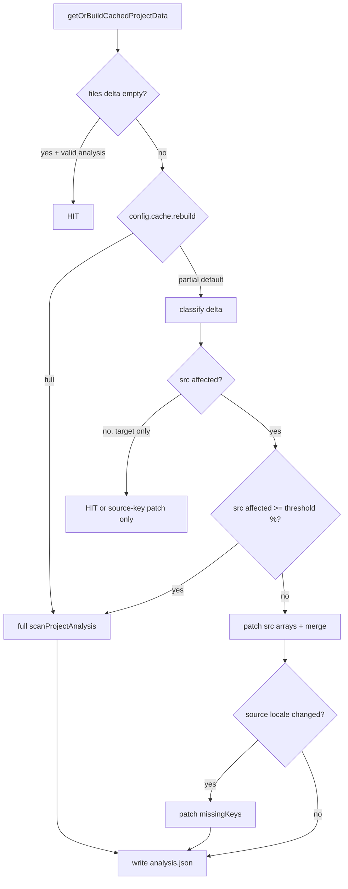

# Project cache phase — disk index + analysis rebuild (**shipped — Phases 0–4**)

**Status:** Phases **0–4** are **shipped** (core + CLI). **Deferred:** Phase 5 (`translations.json` → [`translate-cache.md`](./translate-cache.md); worker segment index → locales follow-up).  
**Public user docs:** [`docs/cli/cache.md`](../../docs/cli/cache.md).  
**Related:** [`locales.md`](./locales.md) · [`translate-cache.md`](./translate-cache.md) (**H.1**, next) · [`apps.md`](./apps.md) (**C.3+**, after H.1).

**For agents (zero chat context):** Phases 0–4 are **done** — see [`shipped-slices.md`](./shipped-slices.md). Next vertical: [`translate-cache.md`](./translate-cache.md).

---

## Ownership (locked)

| Layer | Owns |
|-------|------|
| **`@i18nprune/core`** | Cache paths, `files.json` / `analysis.json` I/O, dispatch (`getOrBuildCachedProjectData`), diff/epoch, **analysis produce/patch**, invalidate primitives, config schema for `cache.*` |
| **CLI** | Host only: `Context` → `CacheState` + `CacheRuntime`, `--no-cache`, `--debug-cache`, thin wrappers (`buildCliCacheRuntime`, `invalidateProjectAnalysisCacheForContext`) |
| **IDE / extension / worker / web** | Same core APIs; no parallel scan truth, no duplicate delta logic |

**Rule:** orchestration and rebuild policy live in **core**. Hosts pass adapters + config; they do not implement merge/patch rules.

---

## On-disk layout (current — shipped)

```txt
~/.i18nprune/cache/
├── meta.json
└── projects/<projectId>/
    ├── files.json      # v1: files + localeSegments + localesLayout
    └── analysis.json   # v1: scan payload (keyObservations, dynamicSites, missingKeys, counts)
```

- **`projectId`:** hash of normalized project root (`packages/core/src/cache/io/hash.ts`).
- **Removed:** `snapshot.json` report-document slot (report builds from **`analysis.json`** + host hooks at run time). Do not reintroduce without a new phase decision.

---

## Two-layer model (mental model)

```txt
files.json     → WHAT changed (fingerprints + delta: added/changed/deleted/unchanged)
analysis.json  → EXPENSIVE derived state (code scan + missingKeys vs source)
```

| Layer | Partial rebuild (shipped) | On miss when patch not allowed |
|-------|---------------------------|--------------------------------|
| **`files.json`** | Layout-only change can reuse cached `src/**` index and rescan locale segments only (`resolveTrackedCurrent`). | Rewrite index from scan. |
| **`analysis.json`** | **Src:** patch arrays under threshold when `rebuild: 'partial'`. **Target locale only:** reuse scan arrays (`target_locale_only`). **Source locale only:** recompute `missingKeys` only (`source_locale_partial`). **Mixed source+target:** full scan. | Full `scanProjectAnalysis`. |

**Remaining (Phase 4):** **Done** — CLI no longer deletes `analysis.json` after target-only sync/generate when dispatch would reuse/patch on the next run.

---

## Shipped baseline (do not regress)

| Item | Location / notes |
|------|------------------|
| Segment-aware `files.json` | `localeSegments`, `localesLayout`, merged diff (`packages/core/src/cache/trackedFiles.ts`, `dispatch.ts`) |
| Single analysis slot | `analysisPath` only (`packages/core/src/cache/setup/paths.ts`) |
| Analysis payload types | `packages/core/src/types/analysis/index.ts` |
| Producer | `produceProjectAnalysis` — full, `patchProjectAnalysisFromSrcDelta`, `patchProjectAnalysisFromSourceLocaleDelta`, or reuse (`packages/core/src/analysis/project.ts`) |
| Dispatch | `getOrBuildCachedProjectData` + `CacheProducerContext` + `decideAnalysisRebuild` |
| Profiles | `cache.profile` + `resolveCacheConfig`; constants in `shared/constants/cache.ts`; CLI `--cache-profile` |
| CLI invalidate after mutate | `invalidateProjectAnalysisCacheAfterLocaleWrites` — skips delete for target-only locale writes; `--debug-cache`: `analysis invalidation: skipped (target locale writes only)` |
| Parity | Refactors must not change `--json` / exit codes / issue codes on fixtures |

---

## Config (`cache` block) — **shipped**

Zod `cacheSchema` in `packages/core/src/config/schema/root.ts`. Resolution: `resolveCacheConfig` in `packages/core/src/cache/resolveConfig.ts`.

```ts
cache?: {
  enabled?: boolean;
  dir?: string;
  mode?: 'readWrite' | 'readOnly';
  profile?: 'safe' | 'balanced' | 'fast'; // default: balanced
  rebuild?: 'partial' | 'full';             // explicit field overrides profile
  fullRescanThresholdPercent?: number;    // 0–100; src bucket only
}
```

| Profile | `rebuild` | `fullRescanThresholdPercent` | `mode` |
|---------|-----------|------------------------------|--------|
| **`safe`** | `full` | `10` | `readWrite` |
| **`balanced`** (default) | `partial` | `40` | `readWrite` |
| **`fast`** | `partial` | `70` | `readWrite` |

| Setting | Behavior |
|---------|----------|
| **`profile`** | Supplies defaults; any **explicit** `rebuild` / `fullRescanThresholdPercent` / `mode` wins. |
| **`rebuild: 'full'`** | Opt-out of partial rebuild. `--debug-cache`: `full (config rebuild=full)`. |
| **`rebuild: 'partial'`** | Classify delta → patch / reuse / full per rules below. |
| **`fullRescanThresholdPercent`** | **Src only:** if affected src files ≥ N% of tracked src → full src scan. |

**CLI:** `--no-cache`, `--debug-cache`, `--cache-profile <safe|balanced|fast>` (merges into config for one run).

**User docs:** [`docs/cli/cache.md`](../../docs/cli/cache.md) (profiles + incremental rebuild).

---

## Delta classification (locked for implementation)

Split `CacheFileDelta` paths using the same keys as `files.json` blocks (see `mergeTrackedFileMaps` in `packages/core/src/cache/trackedFiles.ts`).

```txt
each path in delta.added | .changed | .deleted
    ├─ src index key (under files block, srcRoot-relative)
    │     → SRC_DELTA → incremental scan patch (or full if over threshold / rebuild: full)
    ├─ locale segment key (under localeSegments)
    │     ├─ source locale segment(s)
    │     │     → SOURCE_LOCALE_DELTA → recompute missingKeys (identity-aware in locale_directory)
    │     └─ target locale only
    │           → TARGET_LOCALE_DELTA → no analysis patch (prefer cache hit on scan arrays)
    └─ (layout) localesLayout fingerprint mismatch
          → LAYOUT_DELTA → files.json partial rescan + analysis full rebuild (safe default)
```

**Path canonicalization (Phase 0):** observations must use **srcRoot-relative** paths matching `files` keys. Today scan uses **cwd-relative** `displayPath` — normalize on write and on patch filter (`packages/core/src/extractor/shared/projectScan.ts`).

---

## Locale modes vs analysis fields

Locked leaf identity: [`locales.md` § Leaf identity](./locales.md#leaf-identity-no-cross-file-merge).

| `locales.mode` | Leaf identity | Impact on `analysis.json` |
|----------------|---------------|---------------------------|
| **`flat_file`** | One JSON per locale; logical path unique per file | `missingKeys: string[]` remains valid. Source patch = re-read source file + recompute. |
| **`locale_directory`** | **`(segmentRelativePath, logicalPath)`** for leaf identity | Source reads via `readSourceLocaleLeavesForMissing` + `readLocalePerDirLocaleSurface`; `computeMissingLiteralKeysFromLeaves` unions logical paths across segments. |

**Shipped:** `encodeLocaleLeafIdentity`, `readSourceLocaleLeavesForMissing` (`packages/core/src/analysis/sourceLocaleLeaves.ts`).

---

## Implementation phases (slice order)

One slice per PR. Update [`shipped-slices.md`](./shipped-slices.md) when each closes.

### Phase 0 — Preconditions (**Done**)

| Task | Detail |
|------|--------|
| Canonical src paths | Store/filter `keyObservations` / `dynamicSites` with srcRoot-relative keys aligned to `files.json`. |
| Dispatch hook | Pass `CacheFileDelta` + classified buckets into analysis rebuild (extend `CachedProjectInput` or analysis-only options). |
| Tests | Parity: `fullScan()` ≡ `patch(delta)` for golden fixtures. |

**Acceptance:** unit tests for path normalization; no behavior change when `rebuild: 'full'`.

---

### Phase 1 — Src incremental patch (**Done**)

When **only** `SRC_DELTA` (and policy `rebuild: 'partial'`, under threshold):

| Delta | Action |
|-------|--------|
| **deleted** | Remove rows where `span.filePath` / `filePath` ∈ deleted (canonical paths). |
| **changed** | Drop rows for path → rescan **only that file** via `scanProjectSourceFiles` + filtered `listFiles`. |
| **added** | Rescan new paths only → append. |
| **Then** | `literalKeyUsageFromObservations(merged)`; if source locale unchanged, keep `missingKeys`; else Phase 2 rules. |

Use existing extractors — **no new detection algorithms** (`scanProjectKeyObservations`, `scanProjectDynamicKeySites`).

**Acceptance:** edit 1 `src` file → miss shows 1 changed in delta; observation count updates; no full 270-file walk in tests (mock or counter).

---

### Phase 2 — Locale-aware source patch (**Done**)

| Case | Action |
|------|--------|
| **TARGET_LOCALE_DELTA only** | **Cache hit** on scan arrays; update `files.json` only; **no** `scanProjectAnalysis`. |
| **SOURCE_LOCALE_DELTA, flat_file** | Re-read source segment; recompute `missingKeys`. |
| **SOURCE_LOCALE_DELTA, locale_directory** | Per-segment read (`readFlatLocaleJsonSurface`); merge source key set by `(segmentRelativePath, logicalPath)`; recompute missing. |
| **Schema** | Bump `analysis.json` `data.version` to **2** only if new fields required; document in `parseProjectAnalysisCacheData`. |

**Acceptance:** sync writes 6× target `*.meta.json` → no src rescan; `keyObservations` count unchanged. Edit `en.json` source → `missingKeys` updates without src walk.

---

### Phase 3 — Profiles + threshold + config (**Done**)

| Task | Detail |
|------|--------|
| `cache.profile` + `CACHE_PROFILE_DEFAULTS` | `safe` / `balanced` / `fast` in `shared/constants/cache.ts`. |
| `rebuild` + `fullRescanThresholdPercent` | Explicit fields override profile. |
| `--cache-profile` | Global CLI flag → `cache.profile` for one run. |
| `--debug-cache` | Partial / full / reuse lines including `config rebuild=full`, `target locale only`, `source locale only`. |
| Docs | `docs/cli/cache.md`. |

**Acceptance:** shipped + manual validation on real project (see Phase 2 acceptance).

---

### Phase 4 — Invalidate policy cleanup (**Done**)

| Task | Detail |
|------|--------|
| Review CLI `invalidateProjectAnalysisCacheForContext` after sync/generate | Target-only writes skip delete; core `decideProjectAnalysisCacheInvalidation` mirrors dispatch reuse/patch policy. |
| Keep delete on `rebuild: 'full'` | Explicit opt-out still deletes `analysis.json` after locale writes. |
| `--debug-cache` | `analysis invalidation: skipped (target locale writes only)` or `deleted (config rebuild=full)`. |

**Decision (shipped):** sync/generate pass written locale segment paths to core; target-only mutations do **not** delete `analysis.json` — the next command’s dispatch classifies the `files.json` delta and reuses scan arrays (`target_locale_only`) or patches `missingKeys` (`source_locale_partial`) without a delete-induced full scan. Unconditional delete remains for `cache.rebuild: 'full'` and explicit clear (`invalidateProjectAnalysisCache`).

**Acceptance:** target-only sync → next validate reuses analysis; parity fixtures unchanged.

---

### Phase 5 — Follow-ups (separate PRs)

| Item | Doc |
|------|-----|
| Worker/web segment index convergence | [`locales.md` § After row 10](./locales.md#after-row-10-same-pattern--not-in-row-10-pr) — align hosted snapshot with `localeSegments` keys |
| Translate cache L2 | [`translate-cache.md`](./translate-cache.md) — `translations.json` beside `analysis.json`; uses `inputFilesEpoch` |
| Optional cached `sourceLeafKeys` index | Only if profiling shows JSON re-read dominates |

---

## Rebuild decision flow (reference)



---

## Invalidate vs patch (current vs target)

| Mechanism | After Phases 0–3 | After Phase 4 (shipped) |
|-----------|------------------|-------------------------|
| Dispatch `files_changed` | Patch / reuse / full per `decideAnalysisRebuild` | Same |
| `invalidateProjectAnalysisCacheAfterLocaleWrites` | — | Skips delete for target-only sync/generate writes |
| `invalidateProjectAnalysisCache` (unconditional delete) | Used after every sync/generate | Explicit clear / `rebuild: 'full'` only |
| `run_invalid` | Full producer | Full producer (keep) |

---

## Code map

| Concern | Path |
|---------|------|
| Dispatch / delta | `packages/core/src/cache/dispatch.ts`, `engine.ts` |
| Tracked files / layout reuse | `packages/core/src/cache/trackedFiles.ts`, `localesLayout.ts` |
| Analysis produce | `packages/core/src/analysis/project.ts` |
| Analysis types | `packages/core/src/types/analysis/index.ts` |
| Per-file scan | `packages/core/src/extractor/shared/projectScan.ts`, `keySites/orchestrate.ts`, `dynamic/orchestrate.ts` |
| Missing keys | `packages/core/src/validate/missingLiterals.ts` |
| Locale read / fileOrigin | `packages/core/src/shared/locales/read/flatFileSurface.ts`, `perDirLocaleSurface.ts` |
| Cache types | `packages/core/src/types/cache/index.ts` |
| Config schema | `packages/core/src/config/schema/root.ts` (`cacheSchema`) |
| CLI host | `packages/cli/src/shared/cache/` (`resolve.ts`, `invalidate.ts`, `runtime.ts`) |
| Invalidation policy | `packages/core/src/cache/invalidatePolicy.ts`, `invalidate.ts` |
| Debug lines | `packages/core/src/cache/events.ts` |
| Tests | `packages/core/src/cache/__tests__/runtime.test.ts`, parity under `tests/parity/` |

---

## Testing checklist

**Phases 0–3 (done):**
- [x] `pnpm typecheck` + `pnpm test`
- [x] Unit tests: delta classify, rebuild policy, `resolveCacheConfig`, analysis rebuild, runtime dispatch
- [x] Manual: `--debug-cache validate` — src edit → partial; target edit → skipped (target locale only); source edit → partial (source locale only); `rebuild: 'full'` → `config rebuild=full`

**Phase 4 (done):**
- [x] `pnpm typecheck` + `pnpm test`
- [x] Parity snapshots unchanged on fixtures unless slice requires it
- [x] sync/generate target-only → next validate reuses analysis (no delete-induced full scan)
- [x] Document invalidation decision in Phase 4 section

---

## Tracker (update as slices ship)

| Slice | Status |
|-------|--------|
| Segment-aware `files.json` (locales row 10) | **Done** |
| Single `analysis.json` (no snapshot slot) | **Done** |
| Types in `packages/core/src/types/analysis/` | **Done** |
| Phase 0 — path canonical + dispatch hook | **Done** |
| Phase 1 — src incremental | **Done** |
| Phase 2 — locale source/target classification | **Done** |
| Phase 3 — profiles + `cache.rebuild` + threshold | **Done** |
| Phase 4 — invalidate cleanup | **Done** |
| Phase 5 — worker/web segment index | **Deferred** → [`locales.md`](./locales.md) |
| Phase 5 — `translations.json` (L2) | **Deferred** → [`translate-cache.md`](./translate-cache.md) |

---

## Decisions (locked unless evidence in repo)

1. **Core owns rebuild policy;** CLI/IDE do not fork it.  
2. **`rebuild: 'full'`** is the explicit opt-out — no threshold needed.  
3. **Threshold applies to src file count only**, not locale segments.  
4. **locale_directory** source reads merge all source segments; missing keys compare logical paths across segments (`computeMissingLiteralKeysFromLeaves`).  
5. **Target-only locale changes** must not trigger full code rescan.  
6. **User-facing cache docs** stay in `docs/cli/cache.md`; this file is maintainer-only.
